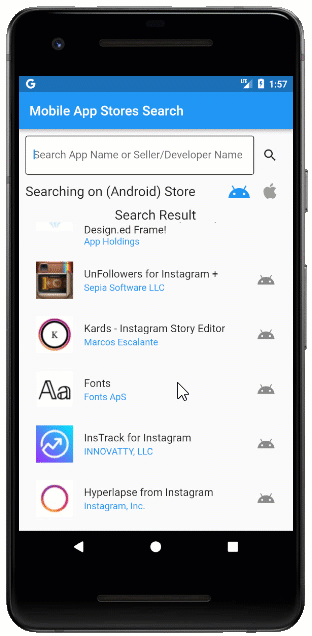
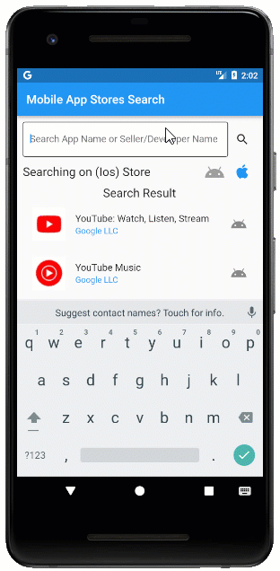
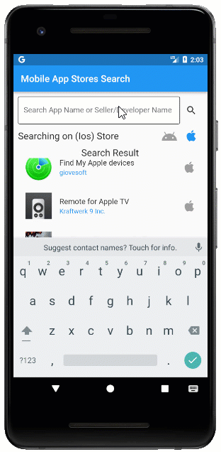
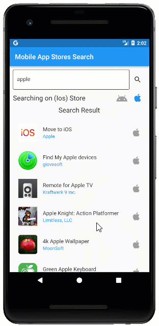

# Mobile App Stores Search

Using this plugin you can find all Android & iOS apps that match a given text query and Access data from Apple Store and Google Play Store via API.

--------------------------------------------------------------------------
Note: This plugin required apikey & uuid for the search api.

You can get both apiKey and uuid for free, here : [Website](https://waltsoft.net/mobile_store_search_api)

----------------------------------------------------------------------------

## Table of contents
* [Search Features](#search-features)
* [Check the demo application](#check-the-demo-application)
* [Useful links](#useful-links)
* [Installation](#installation)
* [Example](#mobile-app-stores-search-example)
* [Support and Feedback](#support-and-feedback)
* [About](#support-and-feedback)

## Search Features

* **Android & iOS** - Get all apps that match a given text query from google and apple store.

 Google Play Store  | Apple Store 
 -------------------------------| ------------------------------ 
  |   
 
* **Search & Apps Data** - You can search app name, developer/seller name and you will get all the app Intelligence data you need for both store.

 Search type  | Intelligence Data
 -------------|------------------ 
  |   
 

## Check the demo application

Explore the full capabilities of our Flutter widgets on your device by installing our sample browser applications from the below app stores, and view samples code in GitHub.


  <a href="https://github.com/awsdataarchitect/mobile_app_stores_search"></a>
  <a href="https://github.com/awsdataarchitect/mobile_app_stores_search"></a>
  
  <a href="https://waltsoft.net/mobile_store_search_api/api_demo"></a> 
  <a href="https://github.com/awsdataarchitect/mobile_app_stores_search"></a>


## Useful links
Take a look at the following to learn more about Mobile App Stores Search Flutter widget:

* [User guide documentation](https://waltsoft.net/mobile_store_search_api/api_doc)
* [Official Website](https://waltsoft.net/)
* [API reference](https://waltsoft.net/mobile_store_search_api/api_doc)

## Installation
 📂 **`pubspec.yaml`**:

**Note:** Install the latest version from [Pub](https://pub.dev/).

```yaml
dependencies:
  mobile_app_stores_search: '^1.0.0'
```
## Mobile App Stores Search Example


#### 1. Import the following package.

```dart
import 'package:mobile_app_stores_search/mobile_app_stores_search.dart';
```

#### 2. After importing the package, initialize the **mobileAppStoresSearch** widget.

```dart

  //-----> change it to your apikey and uuid,
  //You can get both [apiKey] and [uuid] for free, here : http://www.waltsoft-inc.com/ <-----//
  String apiKey = 'MzCPrAGBoYai9FOj6iGCP61Q6SekVGLV1P6Jfjwh';
  String uuid = 'vRmIU18pFljK3ecnG13v';
  late MobileAppStoresSearch mobileAppStoresSearch;
  String query = 'youtube';

  @override
  void initState() {
    //initializing mobile app store search api
    mobileAppStoresSearch = MobileAppStoresSearch(apiKey: apiKey, uuid: uuid);
    super.initState();
  }
```
#### 3. After initializing the package, call the **searchAppInStoreResponseJson** method and
* pass query and the app store type in the parameter.
* it will return a json list of app that match with the query.
* if no match found then it will return null.
```dart

var json = await mobileAppStoresSearch.searchAppInStoreResponseJson(
        searchQuery: query,
        searchInAppleStore: true);

```

Check an example app [Full Example](https://github.com/awsdataarchitect/mobile_app_stores_search/blob/main/example/lib/main.dart)
## Support and feedback

* For any other queries, reach our [Website](https://waltsoft.net).

